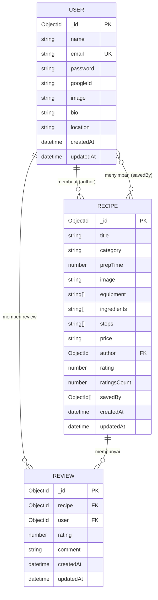

# Entity Relationship Diagram (ERD) - LKMO Recipes

Diagram ERD ini menggambarkan struktur database untuk aplikasi LKMO Recipes.

## Diagram ERD

## Penjelasan Entitas

### 1. USER (Pengguna)
**Primary Key:** `_id`  
**Unique:** `email`, `googleId` (sparse)

**Atribut:**
- `name` (String, Required) - Nama pengguna
- `email` (String, Required, Unique) - Email pengguna
- `password` (String, Conditional) - Password (required jika tidak ada googleId)
- `googleId` (String, Optional, Unique) - ID untuk OAuth Google
- `image` (String, Optional) - URL gambar profil
- `bio` (String, Optional, Max 500) - Bio pengguna
- `location` (String, Optional) - Lokasi pengguna
- `createdAt` (DateTime) - Waktu dibuat
- `updatedAt` (DateTime) - Waktu terakhir diupdate

### 2. RECIPE (Resep)
**Primary Key:** `_id`  
**Indexes:** `title`, `ingredients` (text), `category`, `author`, `createdAt`

**Atribut:**
- `title` (String, Required, Max 200) - Judul resep
- `category` (String, Required, Enum) - Kategori: breakfast, lunch, dinner, snack
- `prepTime` (Number, Required, Min 1) - Waktu persiapan (menit)
- `image` (String, Optional) - URL gambar resep
- `equipment` (Array of String) - Daftar peralatan
- `ingredients` (Array of String, Required) - Daftar bahan
- `steps` (Array of String, Required) - Langkah-langkah pembuatan
- `price` (String, Optional) - Perkiraan harga
- `author` (ObjectId, Required, FK → USER) - Pembuat resep
- `rating` (Number, Default 0, Range 0-5) - Rating rata-rata
- `ratingsCount` (Number, Default 0) - Jumlah rating
- `savedBy` (Array of ObjectId) - Daftar user yang menyimpan
- `createdAt` (DateTime) - Waktu dibuat

### 3. REVIEW (Ulasan)
**Primary Key:** `_id`  
**Unique Composite:** (`recipe`, `user`) - Satu user hanya bisa review sekali per resep

**Atribut:**
- `recipe` (ObjectId, Required, FK → RECIPE) - Resep yang direview
- `user` (ObjectId, Required, FK → USER) - User yang memberi review
- `rating` (Number, Required, Range 1-5) - Rating
- `comment` (String, Required, Max 500) - Komentar/ulasan
- `createdAt` (DateTime) - Waktu dibuat
- `updatedAt` (DateTime) - Waktu terakhir diupdate

## Relasi Antar Entitas

### 1. USER ↔ RECIPE (One-to-Many)
- **Relasi:** Satu user dapat membuat banyak resep
- **Foreign Key:** `RECIPE.author` → `USER._id`
- **Kardinalitas:** 1:N (User membuat banyak Recipe)

### 2. USER ↔ REVIEW (One-to-Many)
- **Relasi:** Satu user dapat memberi banyak review
- **Foreign Key:** `REVIEW.user` → `USER._id`
- **Kardinalitas:** 1:N (User memberi banyak Review)

### 3. RECIPE ↔ REVIEW (One-to-Many)
- **Relasi:** Satu resep dapat memiliki banyak review
- **Foreign Key:** `REVIEW.recipe` → `RECIPE._id`
- **Kardinalitas:** 1:N (Recipe memiliki banyak Review)
- **Constraint:** Unique (`recipe`, `user`) - Satu user hanya bisa review sekali per resep

### 4. USER ↔ RECIPE (Many-to-Many)
- **Relasi:** User dapat menyimpan banyak resep (save/bookmark)
- **Implementasi:** Array `savedBy` di dalam RECIPE
- **Kardinalitas:** M:N (User dapat menyimpan banyak Recipe, Recipe dapat disimpan banyak User)

## Catatan Penting

1. **Timestamps:** Semua entitas memiliki `createdAt` dan `updatedAt` yang diatur otomatis oleh Mongoose
2. **Password Hashing:** Password di-hash menggunakan bcrypt sebelum disimpan
3. **Google OAuth:** User dapat login dengan Google (menggunakan `googleId`)
4. **Text Search:** Recipe memiliki index text search pada `title` dan `ingredients`
5. **Rating System:** Rating di Recipe dihitung dari Review yang diberikan user
6. **Unique Constraints:** 
   - Email harus unique
   - googleId unique (sparse - boleh null tapi jika ada harus unique)
   - Satu user hanya bisa review sekali per resep

## Query Patterns yang Umum

1. **Get User Profile dengan Recipes:**
   - Query USER by `_id`
   - Populate RECIPE where `author = _id`

2. **Get Recipe dengan Author:**
   - Query RECIPE by `_id`
   - Populate USER from `author`

3. **Get Recipe dengan Reviews:**
   - Query RECIPE by `_id`
   - Query REVIEW where `recipe = _id`
   - Populate USER from `user`

4. **Get Saved Recipes:**
   - Query RECIPE where `savedBy` contains `userId`

